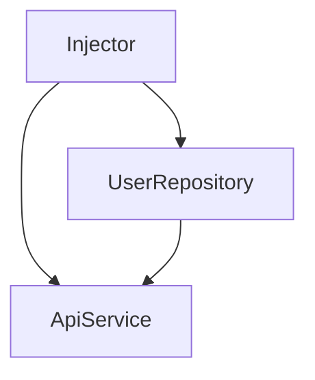

## 오리엔테이션
### 강의를 들어야 하는 이유
1) 대규모 시스템에 필요한 기술 습득
2) 핵심 원리 이해
3) 코드 생산성 향상
4) 공식문서에서 알려주지 않는 강사의 노하우 습득
5) 취업 및 이직의 기회 확장

# 의존성 주입이란
----
의존성 : 어떤 대상이 참조하는 객체 또는 함수

```kotlin
class Engine

class Car {
	val engine = Engine()
}
```
Car 클래스는 Engine 클래스에 의존적이다

Engine 인스턴스를 생성하는 **책임**을 갖고 있다.
- Car은 Engine을 생성하는 책임이 있다

### Inversion of Control 
```kotlin
class Engine

class Car(val engine: Engine) {
	
}
```

> 생성의 책임을 내부에서 외부로 뒤집는다

```kotlin
fun main(args:Array<String>){
	val gasolineCar = Car(GasolineEngine())
	val dieselCar = Car(DieselEngine())
}
```

![[Pasted image 20260306120223.png]]

![[Pasted image 20260306120353.png]]

> 비지니스 로직에 집중
> 즉, 개발과 유지보수가 더 간편해짐

### 테스트 용의성
```kotlin
class CarTest{

	@Test
	fun 'Car 성공 케이스 테스트'(){
		val car = Car(FakeEngine())
		// 중략
	}
}
```

## Injector : 의존성을 클라이언트에게 제공하는 역할

> 객체 생성 책임을 애프리케이션 코드에서 분리하기 위해서
> 객체를 생성하고 의존성을 연결해주는 역할할

### Injector가 필요한 이유

```kotlin
class UserRepository {  
  
    private val api = ApiService()  
  
    fun getUser() {  
        api.request()  
    }  
}

```


구조
```
UserRepository  
      ↓  
 ApiService
```

문제점
- Repository가 **ApiService 생성까지 책임짐**
- 코드 결합도가 높음
- 테스트 어려움
- 객체 교체 어려움

예를 들어 테스트할 때

`FakeApiService 
로 바꾸기 어렵습니다.

### 의존성 주입 시
```kotlin
class UserRepository(
    private val api: ApiService
)
```

`UserRepository  ← ApiService
하지만 여기서 문제가 하나 생깁니다.

> **그럼 ApiService는 누가 만들어 주지?**

==바로 이 역할을 하는 것이 **Injector**입니다.==

- 


### 의존성 주입 코드
```kotlin
class Injector{	
	fun getEngine(){
		return Engine()
	}
}

fun main(args:Array<String>){
	val injector = injector()
	val engine1 = injector.getEngine()
	val engine2 = injector.getEngine()
	val car1 = Car(engine1)
	val car2 = Car(engine2)
}
```

```kotlin
class Injector{	
	val engine = Engine()
}

fun main(args:Array<String>){
	val injector = injector()
	val engine1 = injector.engine
	val engine2 = injector.engine
	val car1 = Car(engine1)
	val car2 = Car(engine2)
}
```
- 동일 Engine 인스턴스 참조 (==자원 공유==)

```kotlin
class Injector {

    fun provideRepository(): UserRepository {
        val api = ApiService()
        return UserRepository(api)
    }

}
```

```text
Injector
   ↓
ApiService 생성
   ↓
UserRepository 생성
```



- 객체의 생성과 사용을 분리
- 결합도 감소
- 테스트 쉬움
- 객체 관리 중앙화
	- Singleton 관리
	- 객체 재사용
	- 라이프사이클 관리
### Injector의 또 다른 명칭
- **Container**
- Assembler
- Provicer
- Factory


#### 의존성 주입 장점 요약
1) 결합도를 낮춘다
2) 재사용성이 가능하다
3) 보일러플레이트 감소
4) 테스트가 쉽다
5) 의존성 관리가 용이하다 (자원 공유)
